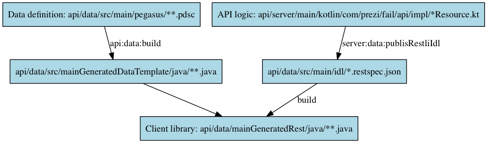

# `fail` API

The API is responsible for managing access to the DynamoDB tables containing all data on scheduled failure runs. It's
the only entry point to this data, no other components touch the database, so database consistency is clearly and
only handled in the API. Any data leaving the API is, by contract, consistent.

## Installing

In the root of the project: `./gradlew api:server:installApp` creates the directory `./api/server/build/install/fail-api` 
that contains all the dependencies and a wrapper script to run `fail-api`: `./api/server/build/install/fail-api/bin/fail-api`.
The process started is a simple but production-ready web server ready to serve REST-ful requests.

To create a distributable tarball you can run `./gradlew api:server:distTar`.

## Configuring

At startup the file a properties file is optionally loaded. The precedence for configuration values
(which are all system properties) looks like this (higher overrides lower):

 - `-D` via `JAVA_OPTS`
 - properties file
  - the path defined in the system property `fail.propertiesFile`, or if that isn't set:
  - `/etc/prezi/fail-api/fail-api.properties`, or if it doesn't exist:
  - no properties file loaded
 - Default values hard-coded in `fail`
 
### AWS
 
You'll also need to provide valid AWS credentials. You can, for example, do this via the `aws.accessKeyId` and
`aws.secretKey` system properties. See [Providing AWS Credentials in the AWS SDK for Java](http://docs.aws.amazon.com/AWSSdkDocsJava/latest/DeveloperGuide/credentials.html)
for other options and details.

Required permissions:

 - create, read and write the DynamoDB tables`fail_ScheduledFailure`, `fail_Run` and `fail_Flag`
 - write to the SQS queue `fail-scheduled-runs`, for injecting a poison pill into the queue on `fail panic`
 
### Full list of supported configuration options for the api

#### `fail.db.dynamoDBEndpoint`
DynamoDB endpoint to connect to. Defaults to `dynamodb.us-east-1.amazonaws.com`.

#### `fail.cli.debug`
Set log level to `DEBUG`

#### `fail.cli.trace`
Set log level to `TRACE`

## Hacking

The API and its clients use [rest.li](http://rest.li/) to communicate in a RESTful and type-safe manner. Some
code generation is involved, leading to a somewhat complicated development flow when you want to change data types
transmitted over the wire or the exposed API functionality. The below graph should make it clear what to do:

